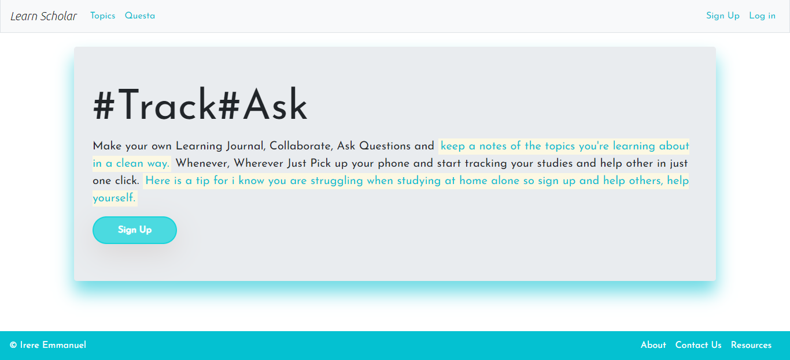
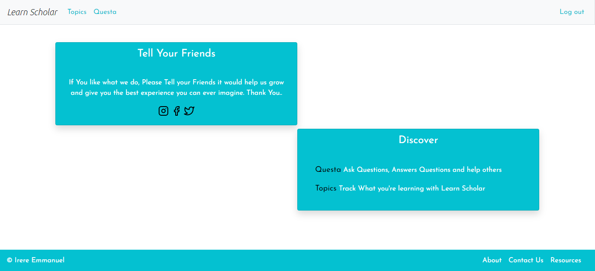
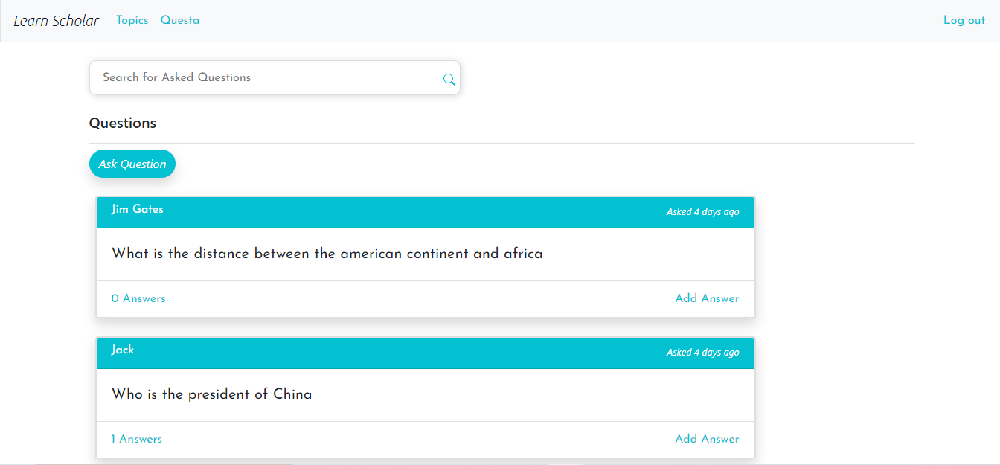
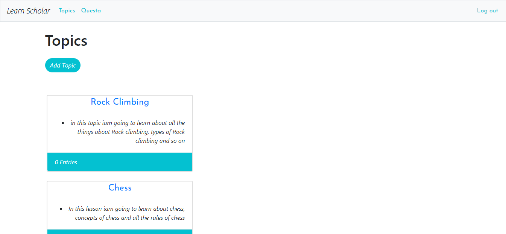

# Learn Scholar

---
---
> You can Find this website on
[learn-scholar.herokuapp.com]('https://learn-scholar.herokuapp.com' "Learn Scholar")

## Track#Ask
----
Make your own Learning Journal, Collaborate, Ask Questions and keep a notes of the topics you're learning about in a clean way. Whenever, Wherever Just Pick up your phone and start tracking your studies and help other in just one click.

## Preview

---
### HomePage

---
### HomePage When Logged In

---
### Questa

---
### Topics

### About
This WebApp is built with Django Python Web framework. Django is High Level Framework

### This Webapp supports:
* [x] PWA

